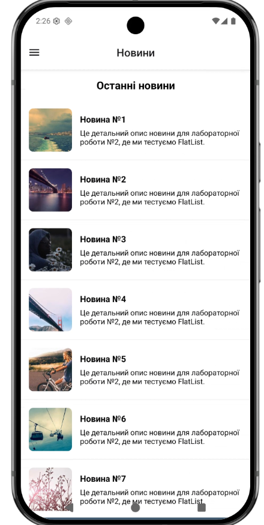
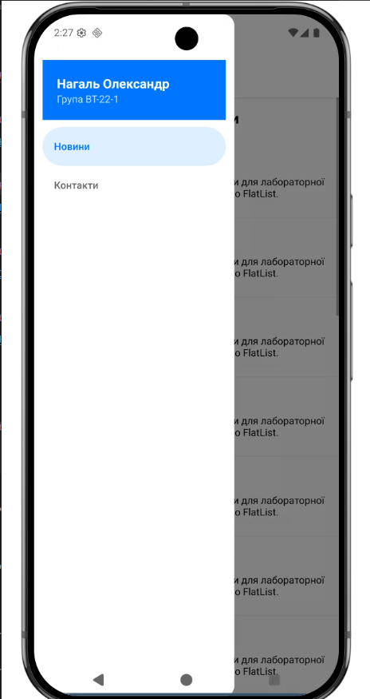
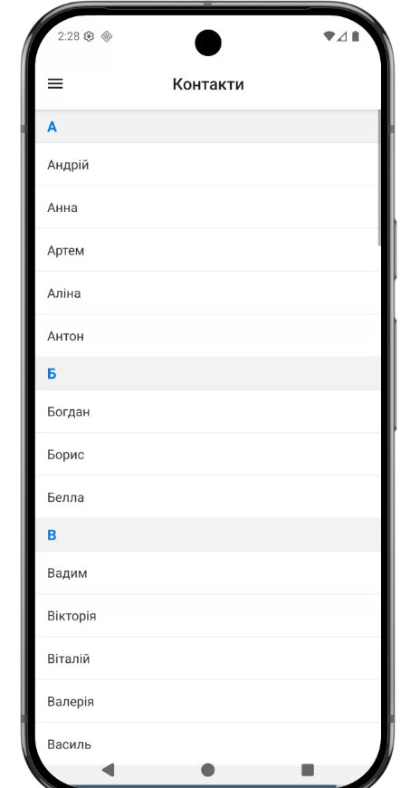

# Лабораторна робота №2

**Тема:** Навігація та списки в React Native

**Виконав:** Нагаль Олександр, група ВТ-22-1

---

## Інструкція запуску

1. Встановити [Node.js](https://nodejs.org/) (версія 18+) та [Expo CLI](https://docs.expo.dev/get-started/installation/).

2. Клонувати репозиторій та перейти в директорію проєкту:
   ```bash
   cd Lab2
   ```

3. Встановити залежності:
   ```bash
   npm install
   ```

4. Запустити проєкт:
   ```bash
   npx expo start
   ```

5. Відсканувати QR-код у додатку **Expo Go** (Android/iOS) або натиснути `a` для запуску на Android-емуляторі / `w` для веб-версії.

---

## Опис реалізованого функціоналу

### Навігація

- **Drawer Navigator** — бічне меню з двома екранами: «Новини» та «Контакти». Містить кастомний заголовок з ім'ям студента та групою.
- **Stack Navigator** — вкладений у Drawer для переходу між списком новин (MainScreen) та деталями новини (DetailsScreen).

### Екрани

| Екран | Опис |
|-------|------|
| **MainScreen** | Список новин на основі `FlatList` з підтримкою pull-to-refresh, нескінченного підвантаження (infinite scroll), оптимізованого рендерингу (`initialNumToRender`, `maxToRenderPerBatch`, `windowSize`). Кожна картка містить зображення та текст. |
| **DetailsScreen** | Детальний перегляд обраної новини з повнорозмірним зображенням, заголовком та описом у `ScrollView`. |
| **ContactsScreen** | Список контактів, згрупованих за першою літерою імені, реалізований через `SectionList` з заголовками секцій та роздільниками. |

### Використані компоненти та бібліотеки

- `react-navigation` (Drawer, Stack)
- `FlatList` — віртуалізований список з pull-to-refresh та infinite scroll
- `SectionList` — секціонований список контактів
- `TouchableOpacity` — навігація між екранами
- `ActivityIndicator` — індикатор завантаження

---

## Скріншоти роботи застосунку

### Головний екран (список новин)


### Бічне меню (Drawer)


### Екран деталей новини


### Екран контактів (SectionList)


---

## Висновки

### 1. Які типи навігації підтримує React Navigation?

React Navigation підтримує такі типи навігації:
- **Stack Navigator** — навігація з переходами вперед/назад (аналог стеку екранів). Кожен новий екран додається поверх попереднього.
- **Drawer Navigator** — бічне висувне меню для перемикання між основними розділами додатку.
- **Bottom Tab Navigator** — панель вкладок внизу екрана.
- **Top Tab Navigator** — вкладки зверху з підтримкою свайпів.
- **Native Stack Navigator** — оптимізований Stack з використанням нативних механізмів платформи.

### 2. Чим відрізняється FlatList від SectionList?

- **FlatList** — плоский список для відображення однорідних даних. Приймає масив об'єктів (`data`) та рендерить кожен елемент через `renderItem`. Підтримує pull-to-refresh, infinite scroll, оптимізацію рендерингу.
- **SectionList** — список із секціями. Приймає масив секцій (`sections`), кожна з яких має `title` та `data`. Додатково дозволяє рендерити заголовки секцій через `renderSectionHeader`. Використовується для групованих даних (наприклад, контакти за алфавітом).

### 3. Як реалізувати нескінченне прокручування (infinite scroll)?

Нескінченне прокручування реалізується у `FlatList` за допомогою двох пропсів:
- `onEndReached` — функція, яка викликається, коли користувач прокрутив список до кінця;
- `onEndReachedThreshold` — поріг (від 0 до 1), який визначає, на якій відстані від кінця списку спрацьовує `onEndReached`.

При спрацюванні `onEndReached` додаються нові елементи до масиву даних, що створює ефект безкінечного списку.

### 4. Як працює pull-to-refresh у FlatList?

Pull-to-refresh реалізується через два пропси:
- `refreshing` — булевий стан, який вказує, чи відбувається оновлення;
- `onRefresh` — функція-колбек, яка викликається при свайпі вниз на початку списку.

Коли `refreshing = true`, відображається індикатор завантаження. Після завершення оновлення стан змінюється на `false`.

### 5. Які параметри оптимізації доступні для FlatList?

- `initialNumToRender` — кількість елементів, які рендеряться при першому відображенні;
- `maxToRenderPerBatch` — максимальна кількість елементів, що рендеряться за одну партію;
- `windowSize` — кількість видимих «вікон» навколо поточної позиції прокрутки, для яких зберігаються відрендерені елементи;
- `removeClippedSubviews` — видаляє з пам'яті елементи, які знаходяться за межами видимої області;
- `getItemLayout` — дозволяє уникнути динамічного вимірювання висоти елементів, якщо вона фіксована.
