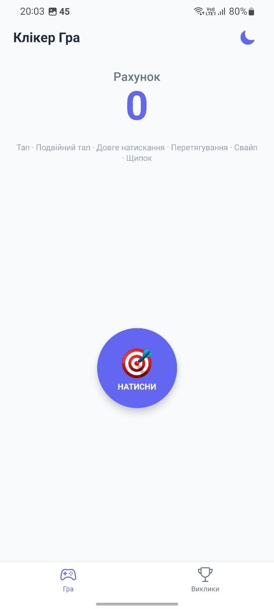
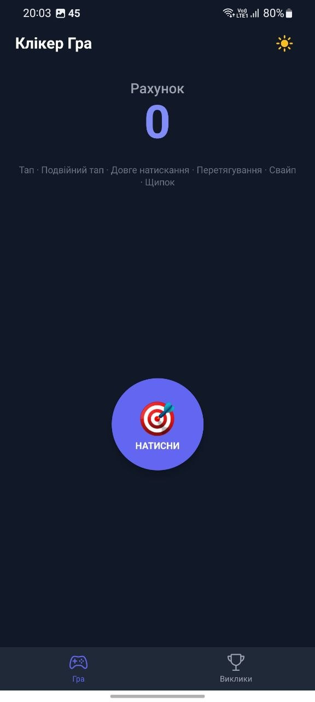
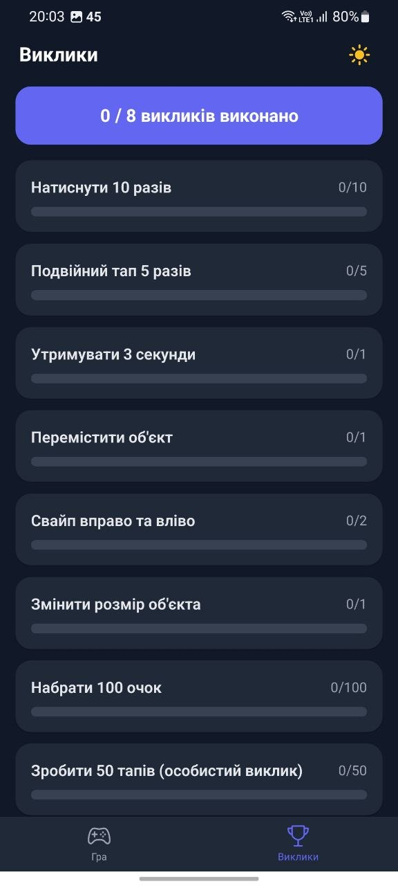

# Лабораторна робота №3 — Клікер Гра (React Native)

**Предмет:** Мобільна розробка
**Репозиторій:** `MobileLabsRN2026/lab3`
**Доступ:** kipz_nsi@ztu.edu.ua

---

## Інструкція запуску

### Вимоги

- Node.js >= 18
- npm
- Expo CLI (`npx expo`)
- Android емулятор / фізичний пристрій з Expo Go, або iOS симулятор

### Встановлення та запуск

```bash
# Клонувати репозиторій
git clone https://github.com/MobileLabsRN2026/lab3.git
cd lab3

# Встановити залежності
npm install

# Запустити проєкт
npx expo start
```

Після запуску відсканувати QR-код у додатку **Expo Go** на телефоні або натиснути `a` для запуску на Android емуляторі.

---

## Опис реалізованого функціоналу

### Основна ідея

Застосунок — інтерактивна клікер-гра, де користувач взаємодіє з об'єктом за допомогою різних жестів, набираючи очки та виконуючи виклики.

### Жести та їх обробка

| Жест | Дія | Очки |
|------|------|------|
| **Tap** (одинарний тап) | Натискання на об'єкт | +1 |
| **Double Tap** (подвійний тап) | Два швидких натискання | +2 |
| **Long Press** (довге натискання) | Утримання > 500 мс | +5 |
| **Pan** (перетягування) | Переміщення об'єкта по екрану | — |
| **Fling Left/Right** (свайп) | Швидкий свайп вліво/вправо | +1–10 (випадково) |
| **Pinch** (щипок) | Зміна масштабу об'єкта | +3 |

Жести реалізовані через бібліотеку `react-native-gesture-handler` з використанням Gesture API v2. Використовується композиція жестів:
- `Gesture.Exclusive` — для пріоритету (double tap > single tap; fling > pan)
- `Gesture.Simultaneous` — для одночасної обробки незалежних жестів

### Система викликів (Challenges)

8 ігрових викликів із прогрес-барами:

1. Натиснути 10 разів
2. Подвійний тап 5 разів
3. Утримувати 3 секунди
4. Перемістити об'єкт
5. Свайп вправо та вліво
6. Змінити розмір об'єкта (pinch)
7. Набрати 100 очок
8. Зробити 50 тапів (особистий виклик)

### Анімації

- **Flash-ефект** — при кожному жесті об'єкт коротко блимає (зміна opacity)
- **Spring-анімація** — після pinch масштаб плавно повертається до 1
- **Переміщення** — об'єкт плавно переміщується при Pan-жесті через `Animated.Value`

### Навігація

Два екрани з нижньою навігацією (`@react-navigation/bottom-tabs`):
- **Гра** — ігровий екран із клікер-об'єктом та рахунком
- **Виклики** — список усіх викликів із прогресом виконання

### Темна/світла тема

- Автоматичне визначення системної теми через `useColorScheme`
- Ручне перемикання кнопкою (іконка сонце/місяць)
- Тема застосовується до всіх елементів: фон, текст, навігація, картки

### Архітектура

- **Context API + useReducer** — управління станом гри (`GameContext`)
- **Context API + useState** — управління темою (`ThemeContext`)
- Компонентний підхід: `ClickerObject`, `ScoreDisplay`, `ChallengeCard`
- Стилізація: `NativeWind` (TailwindCSS для React Native) + inline styles

### Технології

- React Native 0.81 + Expo SDK 54
- TypeScript
- React Navigation v7
- React Native Gesture Handler
- NativeWind (TailwindCSS)
- React Native Safe Area Context

---

## Скріншоти роботи застосунку

> *Скріншоти додати після запуску застосунку*

| Ігровий екран (світла тема) | Ігровий екран (темна тема) | Екран викликів |
|:---:|:---:|:---:|
|  |  |  |

---

## Висновки

У ході виконання лабораторної роботи №3 було розроблено мобільний застосунок — клікер-гру на React Native з використанням Expo.

Під час роботи було опановано:

1. **Обробку жестів** — реалізовано 6 типів жестів (tap, double tap, long press, pan, fling, pinch) за допомогою `react-native-gesture-handler` та Gesture API v2 із композицією жестів через `Exclusive` та `Simultaneous`.
2. **Анімації** — використано `Animated` API для flash-ефекту, spring-анімації масштабу та плавного переміщення об'єкта.
3. **Управління станом** — застосовано патерн `useReducer` із Context API для централізованого управління ігровим станом (рахунок, лічильники жестів, виклики).
4. **Навігацію** — реалізовано Tab-навігацію між екранами гри та викликів за допомогою `@react-navigation/bottom-tabs`.
5. **Підтримку тем** — реалізовано автоматичне визначення системної теми та ручне перемикання між світлою та темною темою.
6. **Стилізацію** — поєднано NativeWind (TailwindCSS) із inline styles для гнучкої стилізації компонентів.

Застосунок демонструє повноцінну роботу з жестами, анімаціями та управлінням станом у React Native.
