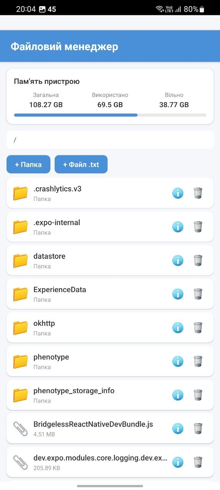
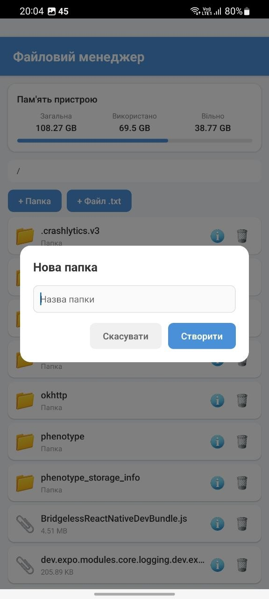
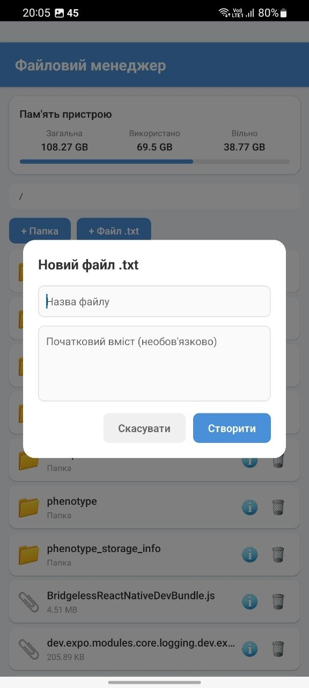
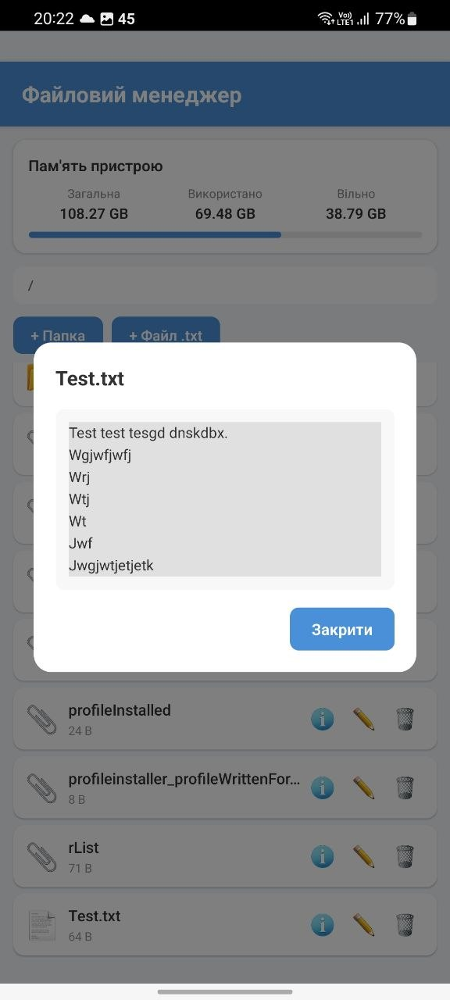
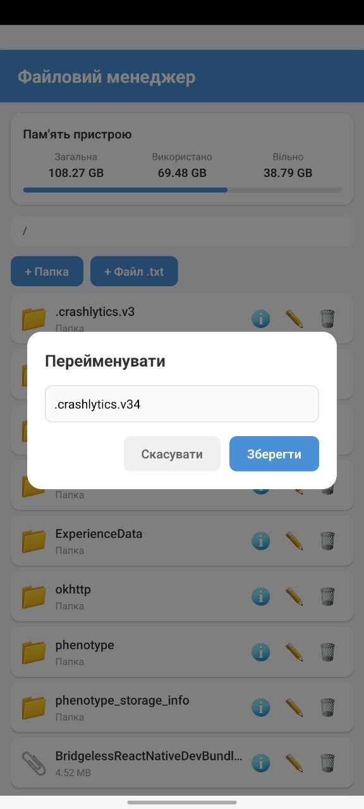
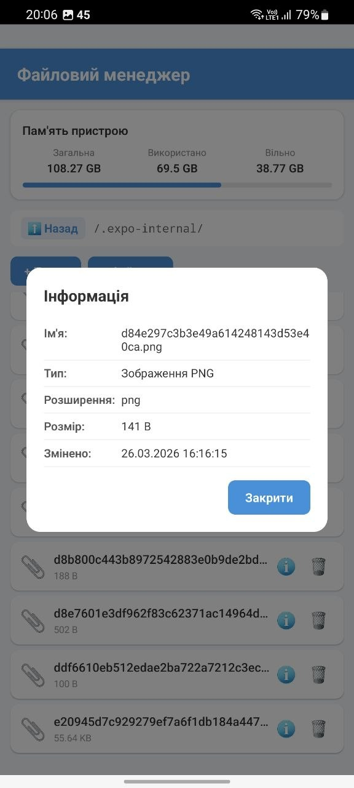
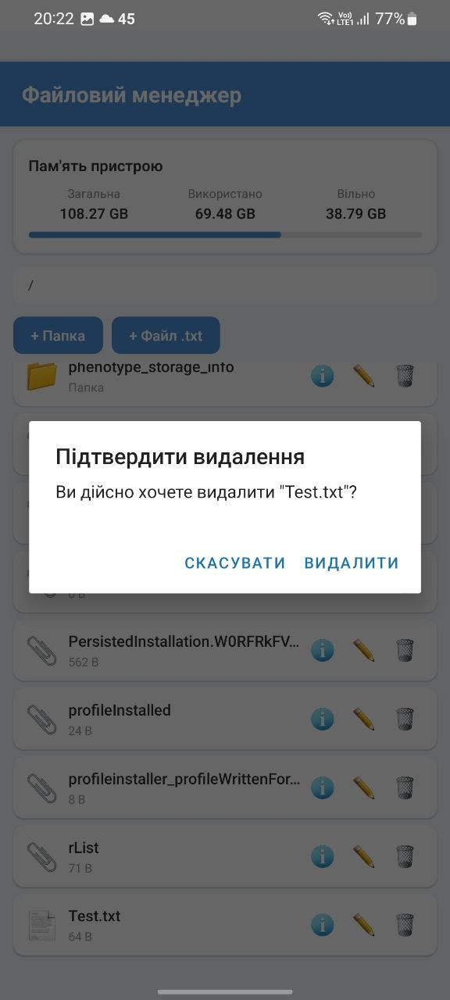

# Лабораторна робота №5 — Файловий менеджер

## Опис

Мобільний застосунок "Файловий менеджер", розроблений на React Native з використанням Expo SDK. Додаток дозволяє переглядати, створювати, редагувати та видаляти файли й папки у внутрішньому сховищі пристрою.

## Інструкція запуску

### Передумови

- Node.js (v18+)
- npm
- Expo Go на мобільному пристрої (або Android емулятор)

### Кроки

```bash
# 1. Клонувати репозиторій
git clone https://github.com/MobileLabsRN2026/lab4.git
cd lab4

# 2. Встановити залежності
npm install

# 3. Запустити проєкт
npx expo start
```

4. Відсканувати QR-код у терміналі за допомогою Expo Go (Android) або камери (iOS).

## Реалізований функціонал

### 1. Навігація по файловій системі
- Перегляд вмісту директорій з відображенням поточного шляху (breadcrumb)
- Перехід у підпапки натисканням на них
- Кнопка "Назад" для повернення до батьківської директорії
- Сортування: папки першими, потім файли за алфавітом

### 2. Інформація про сховище пристрою
- Відображення загального, використаного та вільного місця
- Візуальна шкала (progress bar) використання пам'яті

### 3. Створення папок та файлів
- Створення нових папок через модальне вікно з введенням назви
- Створення `.txt` файлів з можливістю задати початковий вміст

### 4. Перегляд файлів
- Відкриття та перегляд вмісту `.txt` файлів у модальному вікні

### 5. Редагування файлів
- Редагування вмісту текстових файлів із збереженням змін

### 6. Видалення
- Видалення файлів та папок з діалогом підтвердження

### 7. Детальна інформація про файл
- Перегляд атрибутів: ім'я, тип (визначається за розширенням), розширення, розмір, дата останньої зміни
- Підтримка типів: txt, json, js, ts, html, css, md, png, jpg, gif, pdf, xml

## Технології

- **React Native** — фреймворк для мобільної розробки
- **Expo SDK 54** — платформа для React Native
- **expo-file-system** — API для роботи з файловою системою пристрою
- **FlatList** — для відображення списку файлів та директорій
- **Modal** — модальні вікна для створення, перегляду та редагування

## Скріншоти

### Головний екран/Інформація про сховище


### Створення папки


### Створення файлу


### Перегляд файлу


### Редагування файлу


### Інформація про файл


### Видалення файлу

