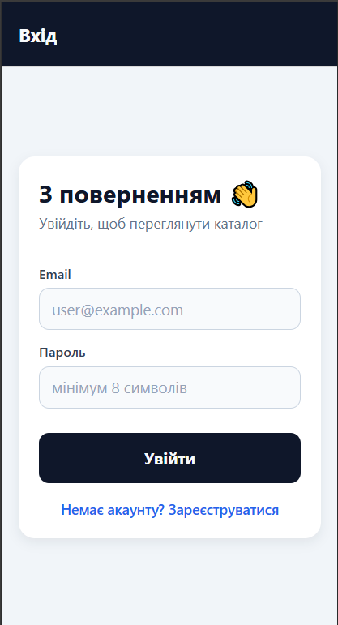
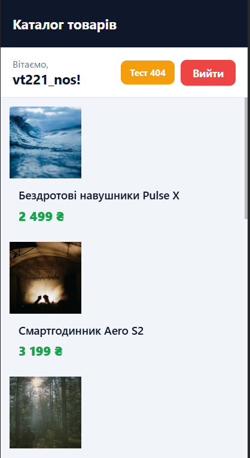

# Лабораторна робота №5 — Навігація з Expo Router

Мобільний застосунок «Каталог товарів» з file-based навігацією, групами маршрутів,
захищеними екранами та динамічними маршрутами на базі **Expo Router**.

## Стек
- Expo SDK 54
- React Native 0.81
- Expo Router 4 (file-based routing)
- React Context (стан авторизації)

## Структура маршрутів
```
app/
├─ _layout.jsx              # AuthProvider + кореневий Stack
├─ index.jsx                # Redirect на /(app) або /(auth)/login
├─ +not-found.jsx           # Екран 404
├─ (auth)/                  # Публічна група
│  ├─ _layout.jsx           # Якщо вже авторизований → /(app)
│  ├─ login.jsx
│  └─ register.jsx
└─ (app)/                   # Захищена група
   ├─ _layout.jsx           # Якщо не авторизований → /login
   ├─ index.jsx             # Каталог товарів (FlatList)
   └─ details/
      └─ [id].jsx           # Динамічний маршрут деталей
```
Назви `(auth)` та `(app)` — групи маршрутів, тому в URL вони не з'являються
(`/login`, `/details/3` тощо).

## Запуск
```bash
cd Lab5
npm install
npm run start
```
Далі відкрити проект у застосунку **Expo Go** на телефоні або в емуляторі
(`a` — Android, `i` — iOS, `w` — web).

## Реалізований функціонал
- **Контекст авторизації** (`context/AuthContext.jsx`): зберігає користувача,
  методи `login(email, password)`, `register(email, password, name)`, `logout()`,
  обчислюваний `isAuthenticated`.
- **Публічні екрани**: вхід та реєстрація з валідацією, переходи між ними через
  `<Link href="/login">` / `<Link href="/register">`.
- **Захищена група `(app)`**: layout перевіряє `isAuthenticated`; якщо `false` —
  виконує `<Redirect href="/login" />`.
- **Каталог товарів**: `FlatList` з 8 товарами (картинка, назва, ціна),
  кнопка **Вийти** в шапці, перехід на деталі через `<Link asChild>`.
- **Деталі товару**: динамічний маршрут `details/[id]`, отримання `id` через
  `useLocalSearchParams`, повна інформація про товар.
- **404**: `+not-found.jsx` з кнопкою повернення на головну.

## Скріншоти

### Екран входу


### Екран реєстрації


### Каталог товарів


### Деталі товару


### Екран 404


## Контрольні запитання

### 1. Як в Expo Router реалізується перенаправлення неавторизованого користувача?
У `_layout.jsx` захищеної групи (`app/(app)/_layout.jsx`) ми зчитуємо стан
авторизації з контексту. Якщо `isAuthenticated === false`, замість навігатора
повертаємо компонент `<Redirect href="/login" />`. Expo Router сам перехоплює
будь-який вхід у дочірні маршрути групи й виконує редирект ще до рендеру
дочірніх екранів. Аналогічна перевірка в `(auth)/_layout.jsx` штовхає вже
залогіненого користувача назад у `(app)`.

### 2. Різниця між `<Link>` та `router.push()`
`<Link>` — декларативний компонент, який рендерить нативний натискальний елемент
із семантикою посилання (на web — це справжнє `<a>`). Підходить для кнопок та
карток, працює з `asChild` для делегування стилізації дочірньому елементу.
`router.push()` — імперативний виклик з хуку `useRouter()`, який ініціюює
навігацію в обробниках подій (наприклад, після успішного входу: ми робимо
`router.replace('/(app)')`). Обираємо `<Link>` для статичних переходів і
`router.push/replace` — коли треба навігувати після побічної дії.

### 3. Як працюють динамічні маршрути та як отримати параметри?
Динамічний сегмент позначається квадратними дужками у назві файлу або теки —
у нас це `app/(app)/details/[id].jsx`. Будь-яке URL на кшталт `/details/5`
співпадає з цим маршрутом, і значення сегмента передається як параметр `id`.
Усередині екрана читаємо параметр через хук `useLocalSearchParams()`:
```jsx
const { id } = useLocalSearchParams();
```
Він також повертає query-параметри, якщо вони є (`?foo=bar`).

### 4. Чому стан авторизації — у глобальному контексті?
Стан `isAuthenticated` потрібен одразу в кількох незалежних місцях: у
`(auth)/_layout.jsx` для редиректу залогінених, у `(app)/_layout.jsx` для
охорони приватних екранів, у каталозі — для відображення імені користувача,
у кнопці «Вийти» — щоб скинути стан. Локальний стан жив би лише в одному
компоненті й вимагав prop drilling через десятки рівнів. Контекст ставить
єдине джерело істини на верхньому рівні (`app/_layout.jsx`), і будь-який
компонент через `useAuth()` отримує актуальні дані без зайвих пропсів.

### 5. Для чого потрібні групи маршрутів `(folderName)` і як вони впливають
на URL?
Групи дозволяють логічно сегментувати маршрути та призначати їм окремий
`_layout.jsx` (різні стилі шапки, охорона, табами тощо), не «забруднюючи» при
цьому URL. Ім'я в круглих дужках Expo Router ігнорує під час побудови шляху:
файл `app/(auth)/login.jsx` доступний як `/login`, а не `/auth/login`. Це
дозволяє розділити публічну й приватну частини застосунку та мати дзеркальні
шляхи у різних групах.

## Висновок
У роботі реалізовано повноцінний застосунок з file-based навігацією Expo
Router. Глобальний `AuthContext` керує сесією, групи `(auth)` та `(app)`
забезпечують чисте розділення публічних і захищених маршрутів, динамічний
сегмент `[id]` дозволяє показувати деталі будь-якого товару, а `+not-found`
охоплює всі неіснуючі шляхи.
