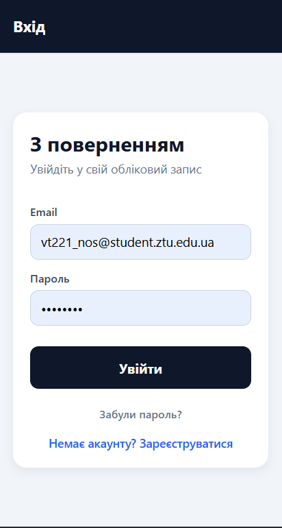
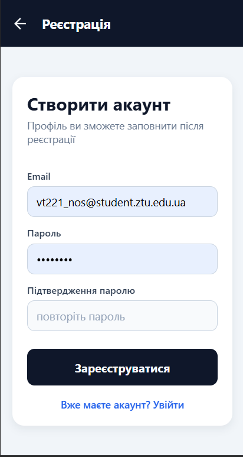
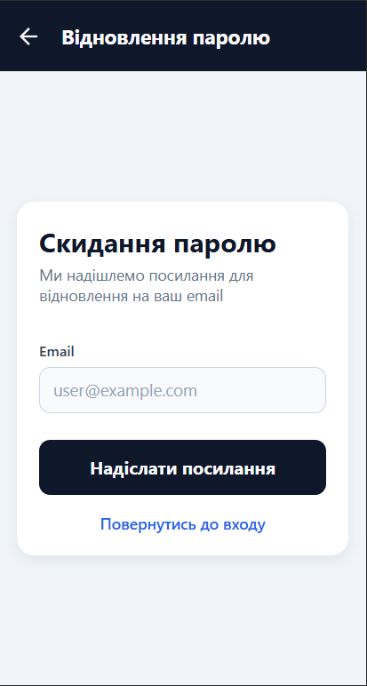
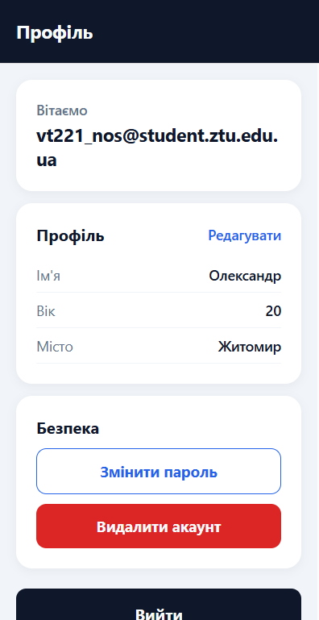
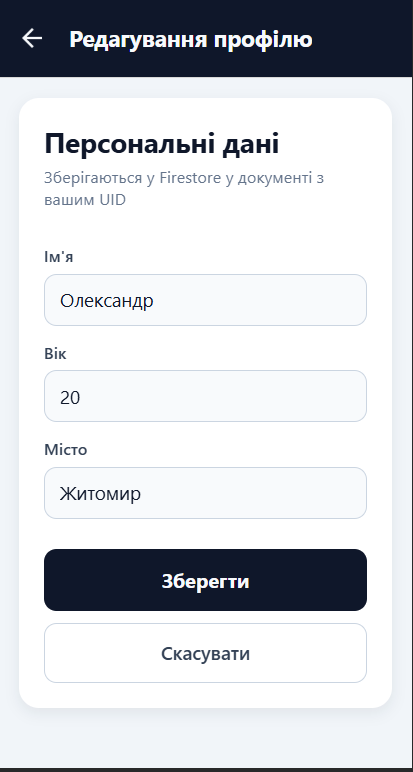
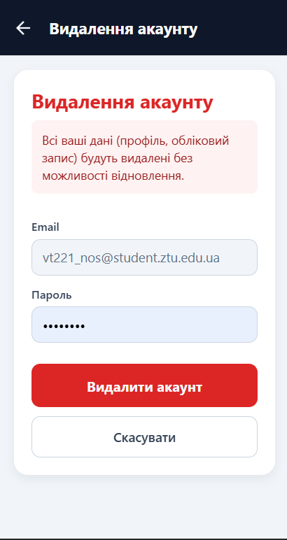

# Лабораторна робота №6

**Тема:** Побудова авторизації та збереження персональних даних у React Native з використанням Firebase Authentication та Firestore.

**Мета:** Набути практичних навичок інтеграції авторизації та обробки персональних даних користувача в мобільному застосунку.

---

## Стек технологій

- **Expo SDK 54** + **Expo Router 6** (маршрутизація на базі файлової системи)
- **React Native 0.81**
- **Firebase 11**:
  - `firebase/auth` — реєстрація, вхід, скидання паролю, повторна автентифікація
  - `firebase/firestore` — зберігання профілю користувача
- **React Context API** — централізоване управління станом авторизації (`AuthContext`)

---

## Структура проєкту

```
Lab6/
├── app/                       # Маршрути Expo Router
│   ├── _layout.jsx            # Кореневий layout з <AuthProvider>
│   ├── index.jsx              # Редирект на (auth) або (app)
│   ├── +not-found.jsx
│   ├── (auth)/                # Публічні маршрути
│   │   ├── _layout.jsx        # Redirect у (app), якщо вже авторизований
│   │   ├── login.jsx
│   │   ├── register.jsx
│   │   └── reset.jsx          # Відновлення паролю
│   └── (app)/                 # Захищені маршрути
│       ├── _layout.jsx        # Redirect у (auth)/login, якщо неавторизований
│       ├── index.jsx          # Домашній екран з даними профілю
│       ├── profile.jsx        # Редагування профілю
│       ├── change-password.jsx
│       └── delete-account.jsx
├── context/
│   └── AuthContext.jsx        # Хук useAuth + обгортка над Firebase Auth
├── firebase/
│   ├── config.js              # Ініціалізація Firebase SDK
│   └── errors.js              # Локалізація кодів помилок
├── services/
│   └── profile.js             # CRUD профілю з перевіркою uid
├── utils/
│   └── validation.js          # Валідація форм
├── firestore.rules            # Правила безпеки Firestore
├── app.json
├── babel.config.js
├── package.json
└── tsconfig.json
```

---

## Інструкція запуску

### 1. Встановлення залежностей

```bash
cd Lab6
npm install
```

### 2. Налаштування Firebase

1. Відкрийте [Firebase Console](https://console.firebase.google.com/) і створіть новий проєкт.
2. У секції **Build → Authentication** увімкніть провайдер **Email/Password**.
3. У секції **Build → Firestore Database** створіть базу у production-режимі.
4. На вкладці **Project settings → General → Your apps** додайте Web-застосунок і скопіюйте об'єкт `firebaseConfig`.
5. Вставте отримані значення у файл `firebase/config.js`:

   ```js
   const firebaseConfig = {
     apiKey: '...',
     authDomain: '...',
     projectId: '...',
     storageBucket: '...',
     messagingSenderId: '...',
     appId: '...',
   };
   ```

6. Опублікуйте правила безпеки з файлу `firestore.rules` у **Firestore → Rules**.

### 3. Запуск

```bash
npm start            # Metro bundler
npm run android      # Android-емулятор / пристрій
npm run ios          # iOS-симулятор (лише macOS)
npm run web          # Веб-версія
```

---

## Реалізований функціонал

### 1. Авторизація користувача
- **Реєстрація** через email + пароль (`createUserWithEmailAndPassword`). При реєстрації автоматично створюється документ у колекції `users` з ID === `uid`.
- **Вхід** існуючого користувача (`signInWithEmailAndPassword`).
- **Вихід** з підтвердженням (`signOut`).

### 2. Збереження персональних даних
- Після входу користувач переходить на екран **Редагування профілю** (`profile.jsx`), де вказує: **ім'я**, **вік**, **місто**.
- Дані зберігаються у Firestore у колекції `users`, у документі з `documentId === uid`.
- Запис відбувається з `merge: true`, тому кожне збереження оновлює лише надані поля.

### 3. Захист доступу
- **Клієнт:** сервіс `services/profile.js` має утиліту `assertOwnUid()`, яка відхиляє будь-який запит, де `uid` не відповідає поточному користувачу.
- **Сервер:** правила `firestore.rules` дозволяють `read/write` тільки власнику документа:

  ```
  match /users/{userId} {
    allow read, update, delete, create:
      if request.auth != null && request.auth.uid == userId;
  }
  ```

### 4. Редагування та видалення облікового запису
- **Редагування:** екран `profile.jsx` підтримує оновлення даних з повторною валідацією.
- **Видалення:** `delete-account.jsx` вимагає повторної автентифікації (пароль) і показує системне підтвердження (`Alert.alert`) перед безповоротним видаленням. Видаляється спочатку документ у Firestore, потім обліковий запис Auth.

### 5. Відновлення паролю
- Екран `reset.jsx` викликає `sendPasswordResetEmail` — користувач отримує email з посиланням на зміну паролю.
- Додатково реалізовано **зміну паролю з додатку** (`change-password.jsx`) через `reauthenticateWithCredential` + `updatePassword`.

### 6. Захищена навігація
- Кореневий `_layout.jsx` обгортає застосунок у `AuthProvider`.
- `(auth)/_layout.jsx` робить `<Redirect href="/(app)" />`, якщо користувач уже авторизований.
- `(app)/_layout.jsx` робить `<Redirect href="/(auth)/login" />`, якщо сесії немає.
- Поки `onAuthStateChanged` ініціалізується, рендериться `ActivityIndicator`, тож не відбувається "миготіння" екранами.

---

## Скріншоти

| Вхід | Реєстрація | Скидання паролю |
|------|------------|-----------------|
|  |  |  |

| Головний екран | Редагування профілю | Видалення акаунту |
|----------------|---------------------|-------------------|
|  |  |  |

---

## Висновки

У ході роботи було спроєктовано та реалізовано повноцінний механізм автентифікації для React Native-застосунку на базі **Firebase Authentication** та **Firestore**. Реалізація поєднує клієнтську валідацію форм, централізований стан через `AuthContext` і декларативний захист маршрутів у **Expo Router** через групи `(auth)` / `(app)` з автоматичним редиректом у `_layout.jsx`.

Ключовий висновок — **захист даних має бути дворівневим**. Клієнтські перевірки (guards у `services/profile.js`) забезпечують швидкий фідбек користувачу та запобігають некоректним запитам, проте **остаточна гарантія — це правила Firestore Security Rules**, що виконуються на сервері й не залежать від клієнта. Такий підхід ізолює дані кожного користувача у межах власного документа `users/{uid}`, а для чутливих операцій (зміна пароля, видалення акаунту) використовується **повторна автентифікація** через `reauthenticateWithCredential`, яка захищає від зловживань навіть у разі викрадення сесії.

Отримані навички інтеграції Firebase — практичний фундамент для будь-якого застосунку зі збереженням персональних даних.
